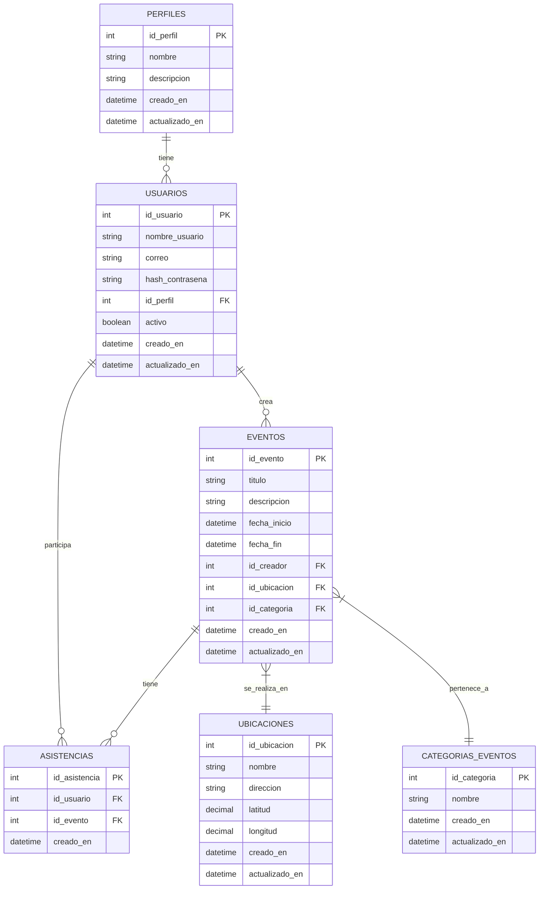

# proyecto eventos

En este repositorio se encuentra un api resful en fastify que maneja eventos con una imagen de docker y un modelo de base de datos relacional con postgres.

# Primeros pasos

Se debe tener la versión estable [**Node.js**](https://nodejs.org/) (LTS) y tener instalado **Yarn**

### Instalación de dependencias

```zsh
# Consola
yarn
```

### Preparación Entorno

Configurar variables de ambiente archivo ```.env``` de la carpeta raiz del proyecto
definir en ese archivo  variables obligatorias para logs
```
DOMAIN=''
PREFIX_LOGGER=''
LOGGER_LEVEL=''
```

## Post instalación

Se debe ejecutar el comando para tener el pre-commit

```zsh
# Consola
yarn husky:install
```

### Ejecutar el proyecto

Solo tienes que ejecutar el comando `yarn dev` y dirigirse a un navegador con la url **http://localhost:8080/api/v1** o **http://localhost:8080/docs**

### Validar versionamiento de las dependencias

```zsh
# Consola
yarn outdated
```

**Si no hay ningún warning ni error entonces puede continuar con los pasos, si por lo contrario los tiene por favor comunicarse con el Arquitecto**

### Copiar la estructura del proyecto en el directorio deseado

```zsh
# Consola -> Ir a la ruta donde se encuentre la plantilla
cp -R ./ destination_folder
```

## Scripts

### build

```zsh
# Se utiliza para compilar el proyecto
yarn build
```

### infra-as-code

```zsh
# Se utiliza generar los recursos de infraestructura en GCP
yarn infra-as-code
```

### lint

```zsh
# Se corre el linter
yarn lint
```

### format

```zsh
# Se utiliza para formatear el código
yarn format
```

### format-check

```zsh
# Se utiliza para verificar el formato del código
yarn format-check
```

### dev

```zsh
# Se utiliza para correr el servidor y estar atento a los cambios en los archivos Typescript
yarn dev
```

### start

```zsh
# Se utiliza para correr el servidor
yarn start
```

### start:debug

```zsh
# Se utiliza para correr el servidor en modo debug
yarn start:debug
```

### test

```zsh
# Se utiliza para ejecutar los tests
yarn test
```

### coverage

```zsh
# Se utiliza para mostrar la cobertura de pruebas
yarn coverage
```

### release

```zsh
# Se utiliza cada vez que se va a desplegar una versión CHANGELOG.md
yarn release
```

## Commit lint

Se utiliza la convención estandar para escribir el mensaje en el commit

[Commit Message Convention](https://github.com/conventional-changelog/commitlint)

---

## Configuración y ejecución con Docker

Para ejecutar este proyecto utilizando Docker y PostgreSQL, sigue estos pasos:

### Prerrequisitos

- Docker
- Docker Compose

### Pasos para ejecutar

1. Asegúrate de tener un archivo `.env` en la raíz del proyecto con las siguientes variables (ajusta los valores según sea necesario):

   ```
    POSTGRES_HOST=db
    DOMAIN='domain'
    SERVICE_NAME='proyecto-events'
    PROJECT_ID='test-senior-developer'
    ENV='local'
    PG_PORT=5432
    POSTGRES_USER=postgres
    POSTGRES_PASS=123456
    POSTGRES_DATABASE=eventos
    PORT=8081
    PREFIX_LOGGER='PREFIX'
    LOGGER_LEVEL='debug'
   ```

2. Construye y ejecuta los contenedores:

   ```bash
   docker-compose up --build
   ```

   Este comando construirá la imagen de Docker y iniciará los servicios definidos en `docker-compose.yml`.

3. Una vez que los contenedores estén en ejecución, la aplicación estará disponible en `http://localhost:8081`.

### Verificación de la conexión con PostgreSQL

Para verificar que la aplicación se está comunicando correctamente con PostgreSQL:

1. Accede al contenedor de la aplicación:

   ```bash
   docker exec -it proyecto-events-app-1 /bin/bash
   ```

2. Dentro del contenedor, conéctate a PostgreSQL:

   ```bash
   psql -U postgres -d eventos -h localhost
   ```

3. Ingresa la contraseña cuando se te solicite (por defecto es '123456').

4. Una vez conectado, puedes ejecutar una consulta de prueba:

   ```sql
   SELECT NOW();
   ```

   Si ves la fecha y hora actuales, significa que la conexión a PostgreSQL está funcionando correctamente.

5. Para salir de psql, escribe:

   ```
   \q
   ```

6. Para salir del contenedor, escribe:

   ```
   exit
   ```

### Detener los contenedores

Para detener y eliminar los contenedores, ejecuta:

```bash
docker-compose down
```

### Notas para el desarrollo

- Los cambios en los archivos fuera del directorio `src` (como package.json) requerirán reconstruir la imagen de Docker.
- Para ver los logs de la aplicación en tiempo real, puedes usar:

  ```bash
  docker-compose logs -f app
  ```

- Si necesitas ejecutar comandos adicionales dentro del contenedor (como instalar nuevas dependencias), puedes hacerlo con:

  ```bash
  docker-compose exec app yarn add <package-name>
  ```
Ejecuta docker-compose down -v para limpiar todo.
Luego, ejecuta docker-compose up --build para reconstruir y iniciar los contenedores.

Esto eliminará los contenedores y los volúmenes asociados.
docker-compose down -v

## Proyecto de Gestión de Eventos

## Configuración de la Base de Datos

Para configurar la base de datos y crear las tablas necesarias, sigue estos pasos:

1. Asegúrate de que el contenedor de Docker esté en funcionamiento:

   ```bash
   docker-compose up -d
   ```

2. Ejecuta el script DDL para crear las tablas:

   ```bash
   docker-compose exec db psql -U postgres -d eventos -f /db/DDL.sql
   ```

3. Verifica que las tablas se hayan creado correctamente:

   ```bash
   docker-compose exec db psql -U postgres -d eventos -c "\dt"
   ```

   Deberías ver una lista de las tablas creadas.

## Inserción de Datos Iniciales

Después de crear las tablas, puedes insertar los datos iniciales siguiendo estos pasos:

1. Ejecuta el script DML para insertar los datos:

   ```bash
   docker-compose exec db psql -U postgres -d eventos -f /db/DML.sql
   ```

2. Verifica que los datos se hayan insertado correctamente ejecutando consultas SELECT para cada tabla:

   ```bash
   docker-compose exec db psql -U postgres -d eventos -c "SELECT * FROM Perfiles;"
   docker-compose exec db psql -U postgres -d eventos -c "SELECT * FROM Usuarios;"
   docker-compose exec db psql -U postgres -d eventos -c "SELECT * FROM Categorias_Eventos;"
   docker-compose exec db psql -U postgres -d eventos -c "SELECT * FROM Ubicaciones;"
   docker-compose exec db psql -U postgres -d eventos -c "SELECT * FROM Eventos;"
   docker-compose exec db psql -U postgres -d eventos -c "SELECT * FROM Asistencias;"
   ```

## Modelo Relacional de la Base de Datos



